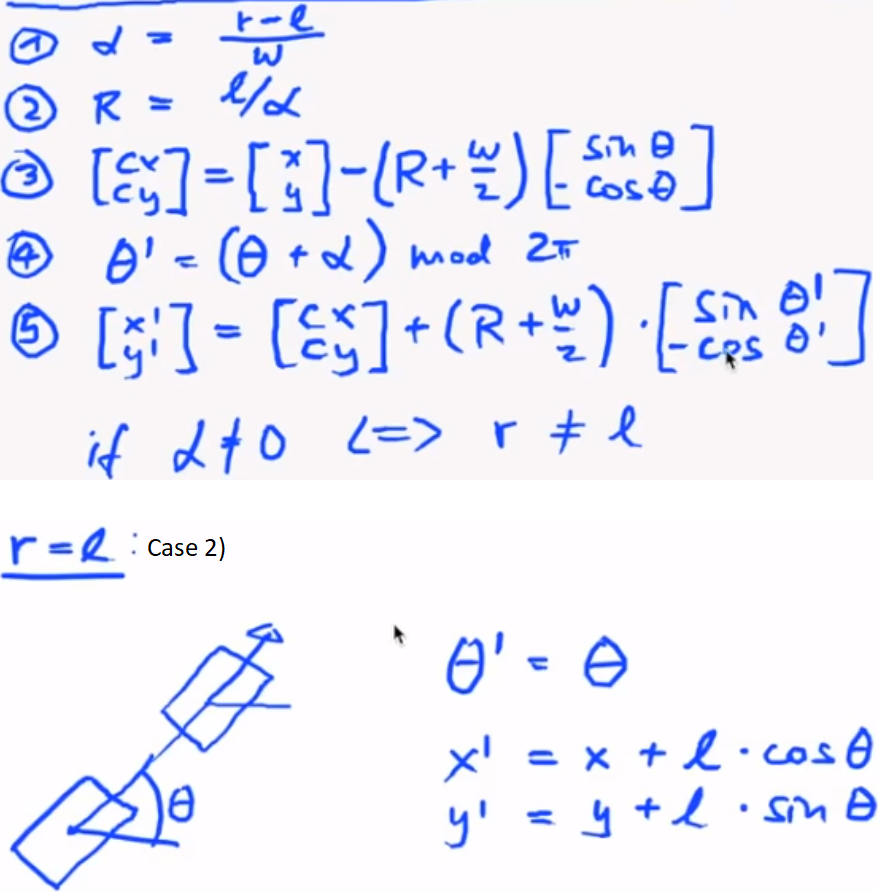

slam_01_a.py file reads the motor encoder reading from the robot4_motors.txt file and plots it.

Note: The initial value of the motor encoder is not 0. Also, we should read the tick difference between consecutive ticks for both the motors.

slam_01_b.py allows us to read the same robot4_motors.txt file in the required format. It uses a method from lego_robot.py file to achieve the same.

slam_02_a.py implements the motion model using Kinematics and the motion encoder data. Initial pose is (0,0,0) i.e. (x,y,theta)

slam_02_b.py changes the following things in slam_02_a.py:
1. The initial pose is now different.
2. Instead of printing the output on console, the output is now stored in a file.
3. Earlier the motion model is applied wrt the LiDAR coordinate system. Now, the motion model is wrt the center of robot coordinate system.
The program execution genereates the poses_from_ticks.txt file

Now, you can view the poses_from_ticks.txt file on logfile_viewer.py program.

Now, you can compare the reference trajectory with the calculated motion model trajectory. Open both the files: "poses_from_ticks.txt" and "robot4_reference.txt" in logfile_viewer.py

You can also view the LiDAR scan data stored in "robot4_scan.txt" in the logfile_viewer.py. To read the data from "robot4_scan.txt" file, please use the lego_robot.py file. The LiDAR scanner has 660 beams. The mapping from beam index to angle is provided by lego_robot.py file.

slam_03_a.py displays a plot of one of the timestep for all the beams. Y-axis stores the depth of the corresponding beam on X-axis.

slam_03_b.py calculates the derivative of one of the plot of the beam data.

slam_03_c.py calculates the (average beam ray number, average depth) for each cylindrical obstacle in our scene. This is done only for a particular timestep. We can iterate over all the timesteps.

slam_03_d.py calculates the (x,y) location in wrt robot center frame for each cylindrical obstacle in our scene. It is done for all the timesteps. It generates the cylinders.txt file.

Now we can view all the files: robot4_scan.txt, cylinders.txt, robot4_reference.txt, robot_arena_landmarks.txt, poses_from_ticks.txt

Note: As of now, we have used motor encoder data to perform motion model which doesn't follow teh actual trajectory. And used scan data to find the location of the cylindrical obstacle in the maze. We now have to combine data from both the stages to create SLAM.

Output: https://www.youtube.com/watch?v=9E6GcZLtZhg