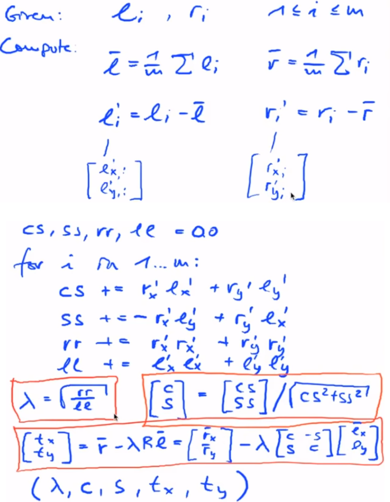

slam_04_a.py file generates the project_landmarks.txt. Just an overview of Unit A.

slam_04_b.py file generates the find_cylinder_pairs.txt. It finds the pairwise minimum distance between the calculated cylindrical obstacle position and their actual position. At each timestep, we will try to adjust the position of the calculated obstacle to its nearest obstacle. This will lead to robot pose getting updated at each timestep.

slam_04_c.py file generates the estimate_transform.txt. It finds the transformation so that the left points (calculated cylindrical obstacle position) aligns with the right points (actual cylindrical obstacle position)

slam_04_d.py file generates the apply_transform.txt. It updates the pose of the robot so that left points align with the right points.

slam_05_a.py file generates the find_wall_pairs.txt. It finds the points near to the wall in the scan data and assigns them the value exactly at the wall.

slam_05_b.py file generates the estimate_wall_transform.txt. It updates the pose of the robot so that the wall points aligns exactly at the wall.

slam_05_c.py file generates the icp_wall_transform.txt. It performs ICP algorithm using the wall points pair.

The output is uploaded on youtube: https://www.youtube.com/watch?v=T3FCrLdm38Y

Note:
1. Feature Based Localization:
- The position of landmarks (cylindrical obstacles in our case) should be known
- Direct solution of similarity transformation
- Correction of the robot pose using the calculated transformation

2. Featureless localization:
- Assign the scan points to the walls
- ICP algorithm to find the optimal transformation

So, far we have either taken the reference feature location or the environment bounding box. But, what if nothing is known about the environment? 