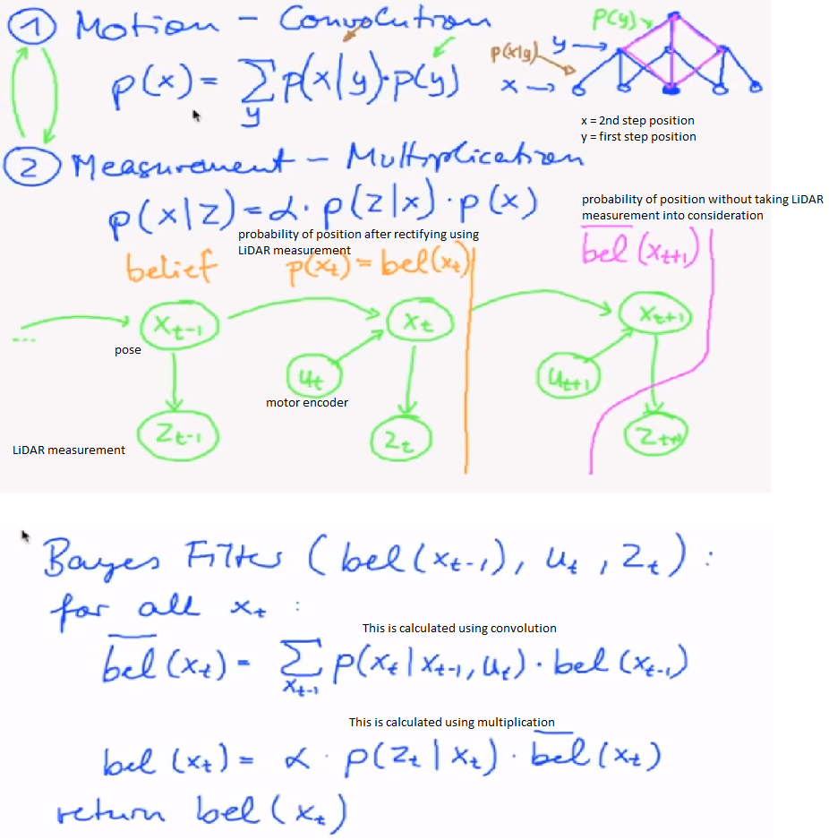
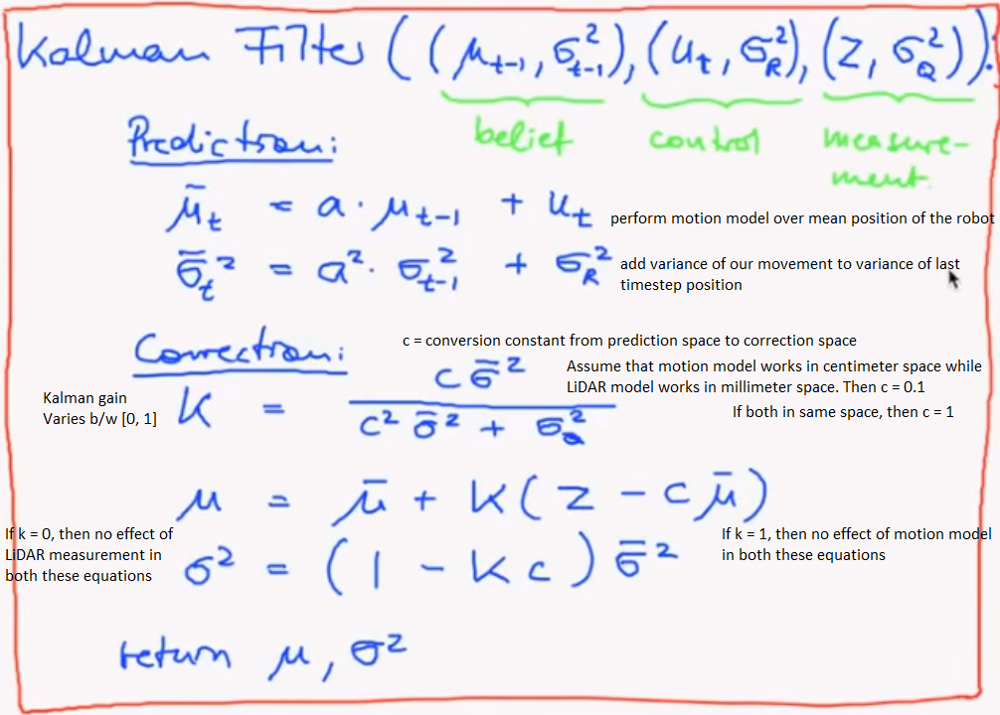
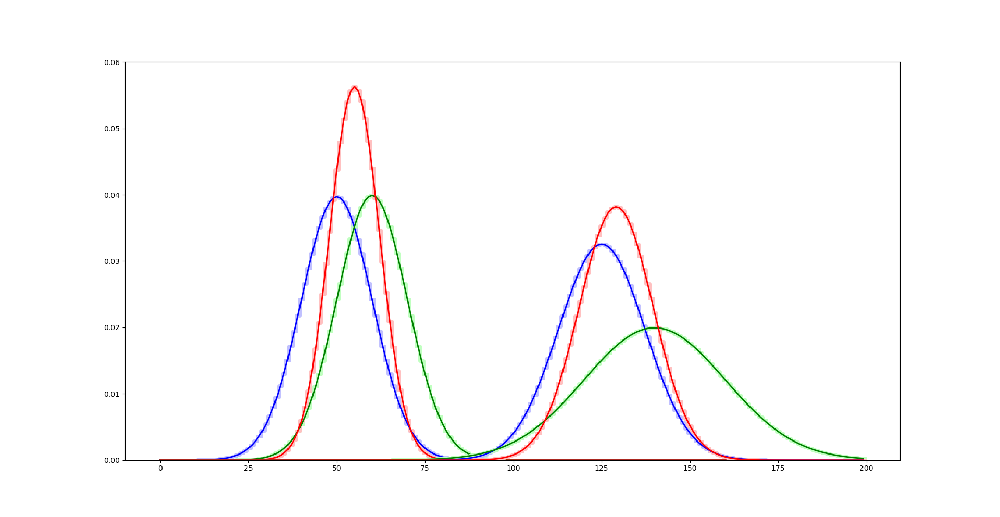

slam_06_a.py moves the distribution by the given offset. Error in the initial pose. No error in the motion encoder.

slam_06_b.py convolves two different distribution. No error in the initial pose. Error in the motion model.

Note: There can be errors in the following measurements:
1) Error in the initial pose estimation: The initial pose has a probability distribution.
2) Error in the motion model: The deviation of the next timestep pose increases.
3) Error in the depth measurement using LiDAR: The correct_pose step incorporates the error.

slam_06_c.py multiplies two distribuiton element by element. In the Baye's theorem, denominator is kept constant. So numerator just becomes multiplication of two probability distribution. P(position/measurement) = normalization_constant * P(measurement/position) * P(position) i.e. P(posterior) = P(measurement/priori) * P(priori)
P(position) is calculated from motion model.
P(measurement/position) is calculated using the LiDAR scan.

slam_06_d.py performs: 1) movement of the robot. There is error in the motion model. Convolution operation takes place 2) LiDAR Measurement to correct the pose. There is error in the measurement as well. Multiplication operation takes place.

slam_06_e.py is a cleaned up version of slam_06_d.py

Note: So far, we have used triangular distribution to perform convolution and multiplication of distributions. Also, we performed the experiment in a small environment. In reality, the environment is very large and we don't have space to store the entire arena as 2D matrix. So, we use Kalman filter.
Kalman filter is nothing but performing 1) prediction step: movement of robot using motion model 2) correction step: correcting the robot's pose using LiDAR measurement. It uses Gaussian distribution as convolution of two gaussians is a gaussian and multiplication of two gaussian is a gaussian. So now, we don't have to perform element by element multiplication or convolution. Kalman has given us the direct mean and standard deviation of multiplication and convolution of two gaussians.

slam_06_f.py implements the Kalman filter. The below figure shows the output.

As can be seen, Kalman filter plot (dark RGB) and Histogram filter plot using Gaussian distribution (light RGB) overlaps exactly. This ensures that Kalman filter gives the exact solution. Histrogram filter is an array based solution. While Kalman filter is a direct solution without using an external array.