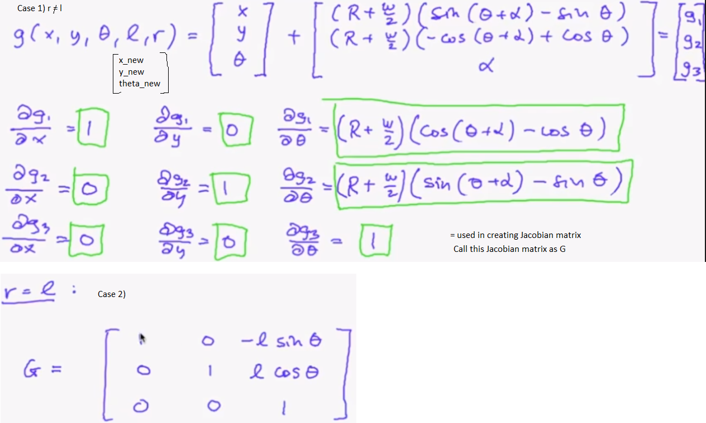
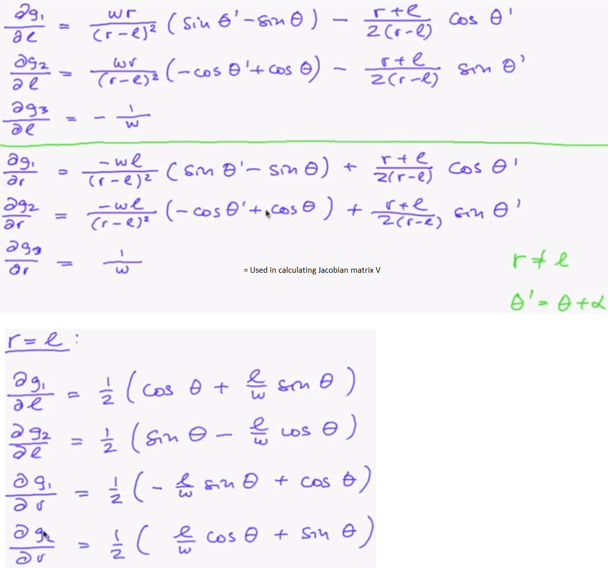
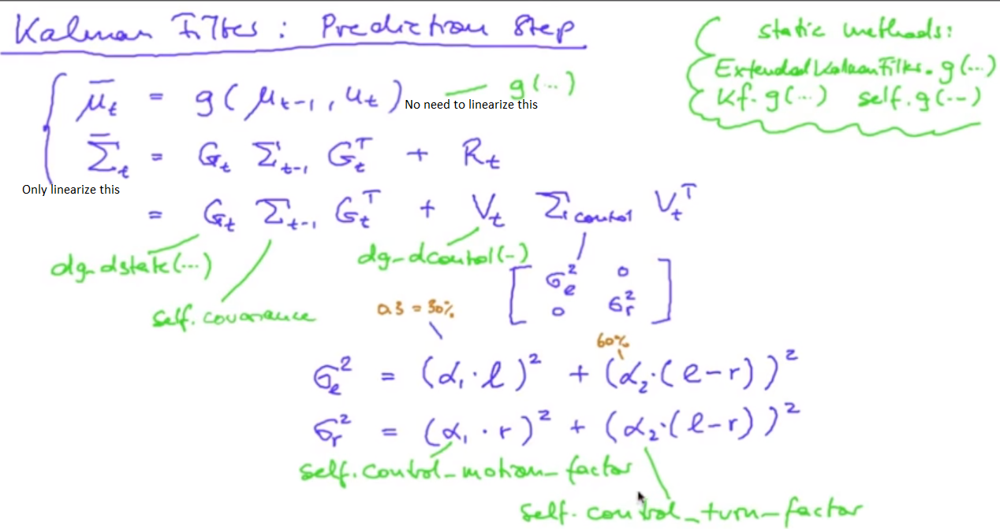
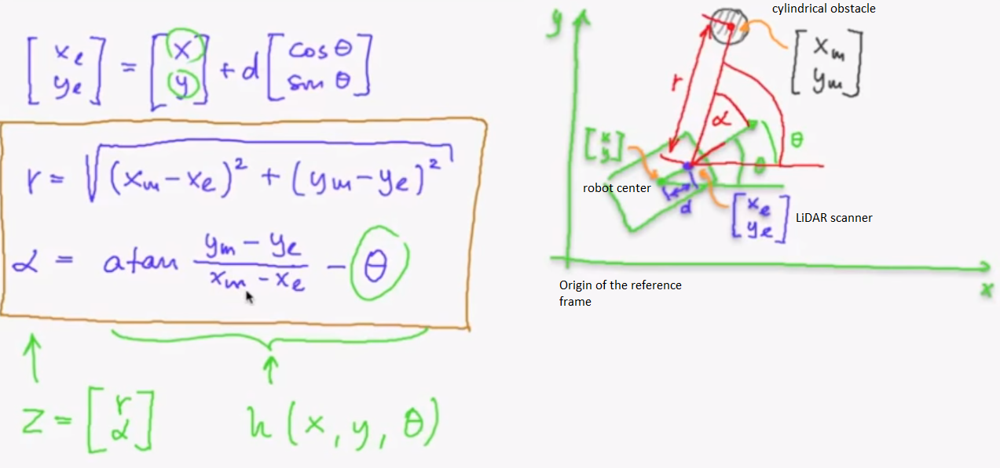
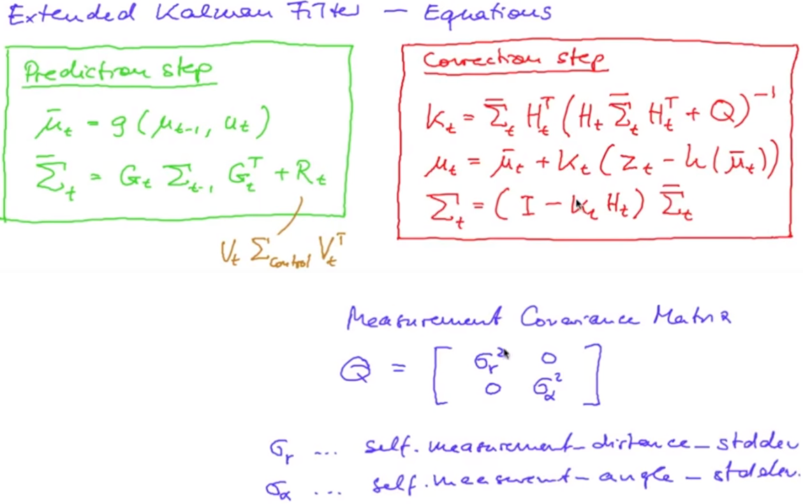

slam_07_a.py generates states_from_ticks.txt file. It is the output of motion model already coded in Unit_A.

Note: Our motion model is not a linear model (consists of cosine and sine terms). But the Kalman filter requires the motion model to be linear. So we will linearize the motion model, this gives rise to Extended Kalman Filter (EKF).
In Unit C, we were working with 1D Kalman filter whose motion model was linear in nature. Now, we are working with 3D Kalman filter (x, y, theta) whose motion model is non-linear. So we have to linearize the motion model before proceeding.

Calculating the Jacobian matrix for state component of the motion model:

slam_07_b.py implements the State Derivative of the Motion Model.

Calculating the Jacobian matrix for control component of the motion model:

slam_07_c.py implements the Control Derivative of the Motion Model.

Performing the EKF prediction step: 

slam_07_d.py generates the kalman_prediction.txt file. It implements the EKF prediction step.

Note: Our LiDAR measurement is again a non-linear function of state (Why? Check the below figure). Again we will linearize it.

Calculating the Jacobian matrix for state component of the LiDAR Measurement:

slam_07_e.py implements the State Derivative of the LiDAR measurement.

The final EKF is:

slam_07_f.py generates the kalman_prediction_and_correction.txt file. It implements both the steps (Prediction and Correction) of EKF. This algorithm uses the location of reference cylindrical obstacles in the correction step. But this time, even a single matched pair (measured LiDAR depth in world coordinate and actual cylindrical obstacle position) can give us a good robot trajectory.

Note: So far, in EKF and Particle Filter, we should know the position of the reference cylindrical obstacles.

Output: https://www.youtube.com/watch?v=PzF1wTL05BA