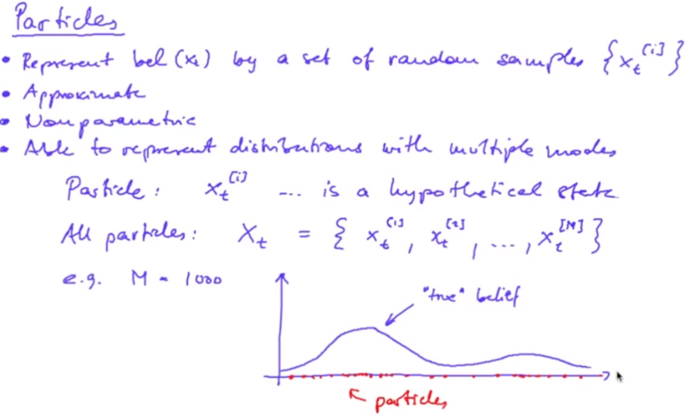
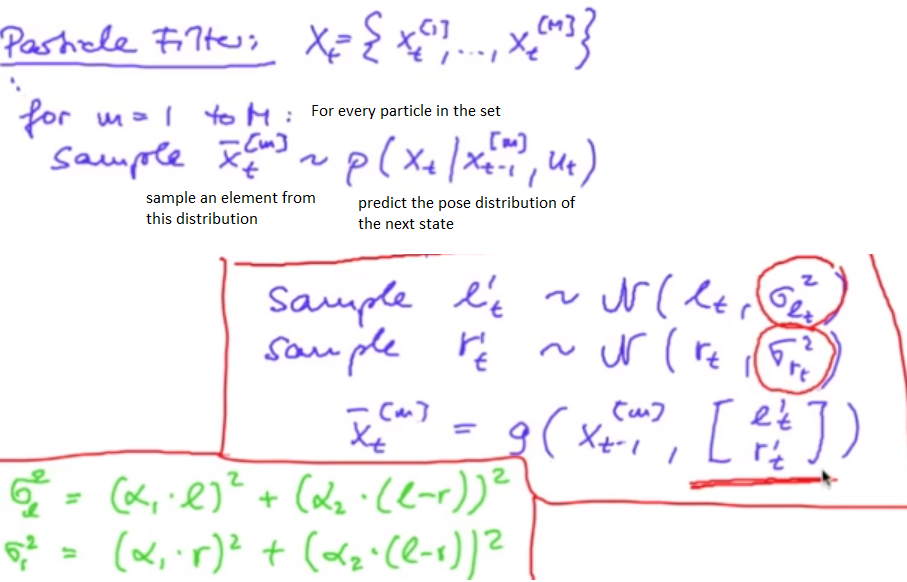
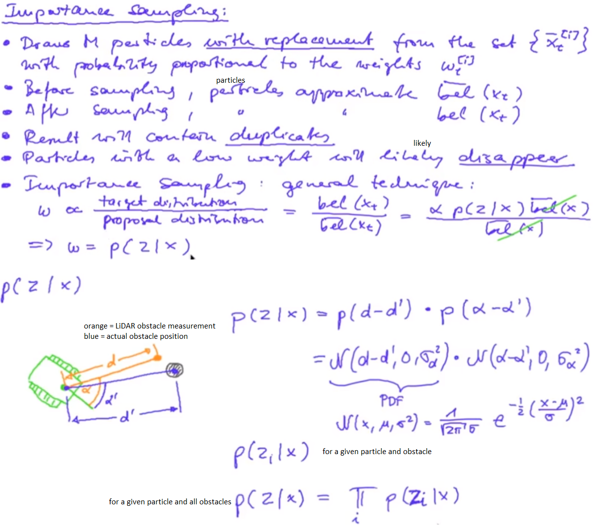
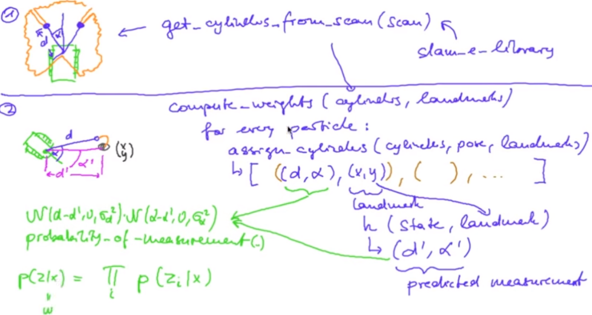
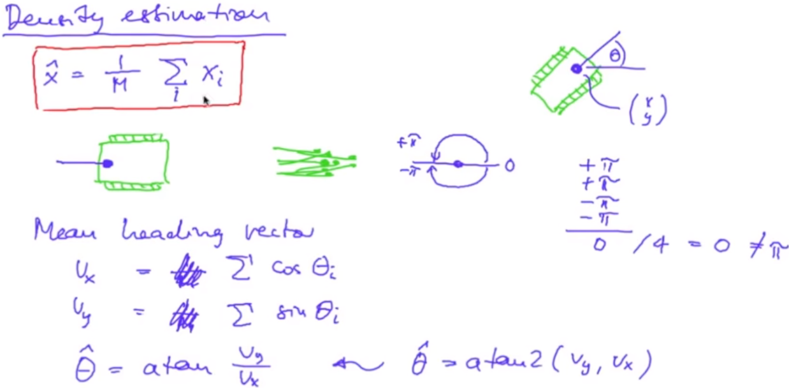

If the initial pose of the robot is unknown, then we can place a gaussian distribution at the center with a very large variance (or) a uniform distribution over the entire arena. Now, the posterior belief will be almost the same as the LiDAR measurement. But, what if the initial pose is multi-modal i.e. the robot can be present at multiple locations with high probability?

Let's talk about particles: High probability corresponds to dense particles in that region.

Sampling from a distribution gives us the particles. Applying Kernel Density Estimation on the particles gives us the distribution curve.

Let's see the Particle Filter: Prediction step

slam_08_a.py generates the particle_filter_predicted.txt file. It performs the particle prediction step.

Let's talk about importance sampling:

Let's see the Particle Filter: Correction step

slam_08_b.py generates the particle_filter_corrected.txt file. It applies the correction step of the particle filter.

Let's see about fitting a Gaussian curve over particles:

slam_08_c.py generates the particle_filter_mean.txt. It finds the mean pose of all the particles at each timestep.

slam_08_d.py adds 3 new modifications to the slam_08_c.py file. It generates the particle_fileter_ellipse.txt file. All the 3 new modifications are explained in the code itself.

Output: https://youtu.be/fDrGrUMfC-8