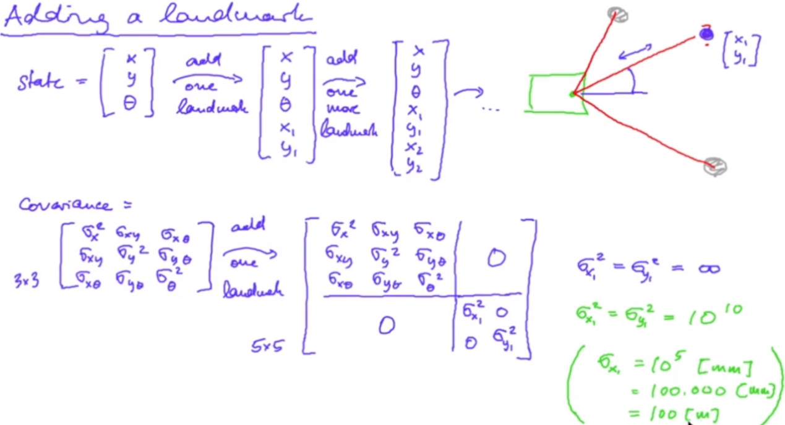

Note: In SLAM, we don't use the landmarks of the actual cylindrical references. We start the mapping process of the environment. We assume that the robot starts creating the map with the initial state of (0, 0, 0). At this position, we search for the landmarks and determine their position using LiDAR measurement relative to the initial pose of the robot. As the robot moves, it observes the same landmarks again (with addition of new landmarks) and the map is updated. The localization error of the robot and other landmarks is reduced as the map is updated.
Now the state not only consists of the robot pose but also the coordinates of all the landmarks observed during the mapping process.

We have two different problems of SLAM:

Here x:y = every thing from timestep x to y. m = map.

Challenges of SLAM:
1) How many landmarks will be there? This affects the size of the state vector. State vector size = 3 (for robot pose) + 2 ((x, y) location of the landmark) * total landmarks
2) Finding correspondences between the landmarks from different timestep.

EKF-SLAM:
The new G matrix:

The new R matrix:

EKF-SLAM prediction step:

Now, we can use the same equation to update our state and covariance matrix.

slam_09_a.py generates the ekf_slam_prediction.txt file. It implements the prediction step of our EKF SLAM.

Note: Adding a landmark

slam_09_b.py generates the ekf_slam_add_landmarks.txt file. It implements the add landmark step of our EKF SLAM.

Note: Please watch SLAM F 06 video to check for the newer calculation for matrix H. Its dimension is (2, 3+2N)

slam_09_c.py generates the ekf_slam_correction.txt file. It implements the correction step of EKF-SLAM.

The last two videos in the Unit_F are conceptual. Please do watch them again.

Output: https://youtu.be/tYdkqf8BSBI